

####   

<dl>

<dt>▶ **<a name="preface" id="preface">Preface</a>**</dt>

<dd>

*   I started this software application in 2010 as a hobby project for my personal learning (reading & listening to foreign texts, saving & reviewing new words and expressions).
*   In June 2011, I decided to publish the software in the hope that it will be useful to other language learners around the world.
*   The software is 100 % free, open source, and in the public domain. You may do with it what you like: use it, improve it, change it, publish an improved version, even use it within a commercial product.
*   English is not my mother tongue - so please forgive me any mistakes.
*   A piece of software will be never completely free of "bugs" - please inform me of any problem you will encounter. Your feedback and ideas are always welcome.
*   My programming style is quite chaotic, and my software is mostly undocumented. This will annoy people with much better programming habits than mine, but please bear in mind that LWT is a one-man hobby project and completely free.
*   Thank you for your attention. I hope you will enjoy this application as I do every day.

</dd>

<dt>▶ **<a name="current" id="current">Current Version</a>**</dt>

<dd>

- [Installation](#install)    

- [How to learn](#learn)  
- [How to use](#howto)  

- [Q & A](#faq)  
- [Setup Tablets](#ipad)  
- [Lang. Setup](#ipad)  

- [Term Scores](#termscores)  
- [Key Bindings](#keybind)  
- [Changelog](#history)

</dd>

<dt>▶ **<a name="links" id="links">Important Links</a>**</dt>

<dd>

*   [**Download](https://github.com/edoreld/learning-with-texts/releases/tag/v.1.6.2)

*   **LWT Reviews and Blog Posts**
    *   [The Mezzofanti Guild: How To Install Learning With Texts On Your Own Computer](https://www.mezzoguild.com/how-to-install-learning-with-texts-lwt/)
    *   Street-Smart Language Learning™: Using Learning with Texts with Anki 2 (in five parts):  
        Part [1](http://www.streetsmartlanguagelearning.com/2012/12/using-learning-with-texts-with-anki-2.html) / [2](http://www.streetsmartlanguagelearning.com/2013/01/using-learning-with-texts-with-anki-2.html) / [3](http://www.streetsmartlanguagelearning.com/2013/01/using-learning-with-texts-with-anki-2_8.html) / [4](http://www.streetsmartlanguagelearning.com/2013/01/using-learning-with-texts-with-anki-2_15.html) / [5](http://www.streetsmartlanguagelearning.com/2013/01/using-learning-with-texts-with-anki-2_21.html)
    *   [Learning with Texts for classical languages](https://diyclassics.com/2014/04/11/learning-with-texts-for-classical-languages/)
    *   [Chicagoseoul's Blog: Learning with Texts](http://chicagoseoul.wordpress.com/2011/07/19/learning-with-texts/)
    *   [Mikoto's Adventures in Japanese: LWT - Learning With Text Introduction](http://mikotoneko.wordpress.com/2012/03/09/lwtp1/)
    *   [Mikoto's Adventures in Japanese: LWT - A Guide to Setting up for Japanese Learning](http://mikotoneko.wordpress.com/2012/03/13/lwt-a-guide-to-setting-up-for-japanese-learning/)
    *   [Mikoto's Adventures in Japanese: LWT - Tricks of the Trade](http://mikotoneko.wordpress.com/2012/04/06/lwt-tricks-of-the-trade/)
    *   [Mikoto's Adventures in Japanese: LWT - Daniel’s Guide for Japanese Usage](http://mikotoneko.wordpress.com/2012/04/17/lwt-daniels-guide-for-japanese-useage/)
    *   [Video about Learning With Texts from Language Vlogger FluentCzech](http://www.youtube.com/watch?v=QSLPOATWAU4)
    *   [Fluent In 3 Months: Introducing LWT](http://www.fluentin3months.com/learning-with-texts/)  

*   **LWT Forum Threads**
    *   [How-To-Learn-Any-Language Forum Thread about LWT](http://how-to-learn-any-language.com/forum/forum_posts.asp?TID=28312&PN=1&TPN=1)
    *   [Sites/Apps like Readlang, Lingq, Lingua.ly, etc.](https://forum.language-learners.org/viewtopic.php?f=19&t=1993)
    *   [Best dictionaries for use with LWT?](https://forum.language-learners.org/viewtopic.php?f=19&t=5648)
    *   [Getting the most out of LWT](https://forum.language-learners.org/viewtopic.php?f=19&t=7156)

*   **Additional Resources**
    *   Similar software or services
        *   [FLTR - Foreign Language Text Reader](https://sourceforge.net/projects/fltr/) (Open Source Java Desktop Application).
        *   [LingQ.com](http://lingq.com) (Web based service with tutoring. An account costs US$ 10 per month).
        *   [lingro.com](http://lingro.com/) (An on-line environment that allows anyone learning a language to quickly look up and learn the vocabulary).
        *   [readlang.com](http://readlang.com/) (An on-line service where you can import articles, read and translate them, and learn new words. Price: US$ 5 per month or US$ 48 per year).
    *   Resources for various languages
        *   [GoogleDocs Spreadsheet](http://tinyurl.com/cbpndlt) with recommendations for LWT Language Settings ("Templates")  
            **Important:** Please be careful when making additions or corrections!
    *   For learners of Japanese
        *   [MeCab - Yet Another Part-of-Speech and Morphological Analyzer](http://taku910.github.io/mecab/)
    *   For learners of Chinese
        *   ["Jieba" Chinese text segmentation](https://github.com/fxsjy/jieba) ([Python](https://www.python.org/) needed). Usage: Download, unzip, run: _python -m jieba -d ' ' input.txt >output.txt_

</dd>

<dt>▶ **<a name="abstract" id="abstract">Abstract</a>**</dt>

<dd>

*   [_Learning with Texts_ (LWT)](http://sourceforge.net/projects/lwt/) is a tool for Language Learning, inspired by:
    *   [Stephen Krashen's](http://sdkrashen.com) principles in Second Language Acquisition,
    *   Steve Kaufmann's [LingQ](http://lingq.com) System and
    *   ideas from Khatzumoto, published at ["AJATT - All Japanese All The Time"](http://www.alljapaneseallthetime.com).
*   You define languages you want to learn and import texts you want to use for learning.
*   While listening to the audio (optional), you read the text, save, review and test "terms" (words or multi word expressions, 2 to 9 words).
*   In new texts all your previously saved words and expressions are displayed according to their current learn statuses, tooltips show translations and romanizations (readings), editing, changing the status, dictionary lookup, etc. is just a click away.
*   Import of terms in TSV/CSV format, export in TSV format, and export to [Anki](http://ankisrs.net) (prepared for cloze tests), are also possible.  

*   **<u>MOST IMPORTANT:</u>  

    To run LWT, you'll need:**  

    **(1) A modern web browser.**  
    I recommend (in this order)
    *   [Chrome](http://www.google.com/chrome/),
    *   [Firefox](http://www.mozilla.org/firefox/),
    *   [Safari](http://www.apple.com/safari/), or
    *   [Microsoft Edge](https://www.microsoft.com/en-us/windows/microsoft-edge).  
    **(2) A local web server.**  
    An easy way to install a local web server are preconfigured packages like
    *   [EasyPHP](http://www.easyphp.org/) or [XAMPP](https://www.apachefriends.org/download.html) (Windows), or
    *   [MAMP](http://mamp.info/en/index.html) (macOS), or
    *   a [LAMP (Linux-Apache-MySQL-PHP) server](http://en.wikipedia.org/wiki/LAMP_%28software_bundle%29) (Linux).  
    **(3) The LWT Application.**  
    The ZIP Archive _lwt_v_x_y.zip_ can be downloaded [here](http://sourceforge.net/projects/lwt/files/).  
    The installation is explained [here](#install).  

</dd>

<dt>▶ **<a name="features" id="features">Features</a>**</dt>

<dd>

*   You define languages you want to learn.
*   You define the web dictionaries you want to use.
*   You define how sentences and words in the language will be split up.
*   You upload texts, and they are automatically split into sentences and words! Later re-parsing is possible.
*   Optional: Assign the URL of an mp3 audio file of the text (Dropbox, local server, ...) in order to listen while reading the text.
*   You read the text while listening to the audio, and you see immediately the status of every word (unknown, learning, learned, well-known, ignored).
*   You click on words, and you use the external dictionaries to find out their meanings.
*   You save words or expressions (2..9 words) with optional romanization (for asiatic languages), translations and example sentence, you change its status, you edit them whenever needed (like in LingQ).
*   You test your understanding of words and expressions within or without sentence context.
*   MCD (Massive-Context Cloze Deletion) testing, as proposed by Khatzumoto @ AJATT, built-in!
*   See your progress on the statistics page.
*   You may export the words and expressions and use them in Anki or other programs.
*   You may upload words and expressions into LWT (from LingQ or other sources, CSV/TSV) - they are immediately available in all texts!
*   **New since Version 1.5.0:** Create and edit an improved annotated text version (a [hyperliteral translation](http://learnanylanguage.wikia.com/wiki/Hyperliteral_translations) as [interlinear text](http://en.wikipedia.org/wiki/Interlinear_gloss)) for online or offline learning. Read more [here](#il).
*   The application is 100 % free, open source, and in the Public Domain. Do with it what you like!
*   Prerequisites: a local webserver (Apache, PHP, mySQL), e.g. EasyPHP or XAMPP (Windows), MAMP (macOS), or a LAMP server (Linux).
*   Enjoy your language learning!

</dd>

<dt>▶ **<a name="restrictions" id="restrictions">Restrictions</a>**</dt>

<dd>

*   Texts and vocabulary terms with Unicode characters outside the [Basic Multilingual Plane](https://en.wikipedia.org/wiki/Plane_(Unicode)#Basic_Multilingual_Plane) (BMP; U+0000 to U+FFFF), i.e. with Unicode characters U+10000 and higher, are not supported. Therefore, characters for almost all modern languages, and a large number of symbols, are supported; but historic scripts, certain symbols and notations, and Emojis are not supported.

</dd>

<dt>▶ **<a name="license" id="license">(Un-) License</a>**</dt>

<dd>

*   [_"Learning with Texts"_ (LWT)](http://sourceforge.net/projects/lwt/) is free and unencumbered software released into the PUBLIC DOMAIN.  
    Anyone is free to copy, modify, publish, use, compile, sell, or distribute this software, either in source code form or as a compiled binary, for any purpose, commercial or non-commercial, and by any means.  
    In jurisdictions that recognize copyright laws, the author or authors of this software dedicate any and all copyright interest in the software to the public domain. We make this dedication for the benefit of the public at large and to the detriment of our heirs and successors. We intend this dedication to be an overt act of relinquishment in perpetuity of all present and future rights to this software under copyright law.  
    Please read also the [disclaimer](#disclaimer).  
    For more information, please refer to [http://unlicense.org/](http://unlicense.org/).  

*   The following software packages, bundled within the LWT software, have different licenses:
    *   jQuery, jQueryUI - Copyright © John Resig et.al., [http://jquery.org/license](http://jquery.org/license) (js/jquery.js, js/jquery-ui.min.js)
    *   jQuery.ScrollTo - Copyright © Ariel Flesler, [http://flesler.blogspot.com](http://flesler.blogspot.com) (js/jquery.scrollTo.min.js)
    *   Jeditable - jQuery in-place edit plugin - Copyright © Mika Tuupola, Dylan Verheul, [http://www.appelsiini.net/projects/jeditable](http://www.appelsiini.net/projects/jeditable) (js/jquery.jeditable.mini.js)
    *   jQueryUI Tag-it! - Copyright © Levy Carneiro Jr., [http://aehlke.github.com/tag-it/](http://aehlke.github.com/tag-it/) (js/tag-it.js)
    *   оverLIB 4.22 - Copyright © Erik Bоsrup, [http://www.bosrup.com/](http://www.bosrup.com/) (js/overlib/...)
    *   sorttable - Copyright © Stuart Langridge, [http://www.kryogenix.org/code/browser/sorttable/](http://www.kryogenix.org/code/browser/sorttable/) (js/sorttable/...)
    *   CountUp - Copyright © Praveen Lobo, [http://PraveenLobo.com/techblog/javascript-countup-timer/](http://PraveenLobo.com/techblog/javascript-countup-timer/) (js/countuptimer.js)
    *   jPlayer - Copyright © Happyworm Ltd, [http://www.jplayer.org/about/](http://www.jplayer.org/about/) (js/jquery.jplayer.min.js, js/Jplayer.swf, css/jplayer_skin/...)
    *   Floating Menu - Copyright © JTricks.com, [http://www.jtricks.com/licensing.html](http://www.jtricks.com/licensing.html) (js/floating.js)
    *   mobiledetect - Copyright © Șerban Ghiță & Victor Stanciu, [http://mobiledetect.net](http://mobiledetect.net/) (php-mobile-detect/Mobile_Detect.php)
    *   iUI - Copyright © iUI, [http://www.iui-js.org/](http://www.iui-js.org/) (iui)  

*   The icons in the "icn" subdirectory are Copyright © [Yusuke Kamiyamane](http://p.yusukekamiyamane.com/). All rights reserved. Licensed under a [Creative Commons Attribution 3.0 license](http://creativecommons.org/licenses/by/3.0/). The wizard icon "wizard.png" is the "Free Wizard Icon", free for commercial use, from [icojam.com](http://www.icojam.com/blog/?p=159) (Author: [IcoJam / Andrew Zhebrakov](http://www.icojam.com)).  

*   The following examples, supplied within the LWT download package, have the following licenses:
    *   Chinese: The Man and the Dog - Copyright © Praxis Language LLC, now ChinesePod Ltd., [Source](http://chinesepod.com/lessons/the-man-and-the-dog), MP3 licensed under a [Creative Commons 3.0 Unported license](http://creativecommons.org/licenses/by/3.0/).
    *   German: Die Leiden des jungen Werther by Johann Wolfgang von Goethe - in the [Public Domain](http://www.gutenberg.org/wiki/Gutenberg:The_Project_Gutenberg_License), Source: [Text](http://www.gutenberg.org/ebooks/2407), [Audio](http://www.gutenberg.org/ebooks/19794).
    *   French: Mon premier don du sang - Copyright © France Bienvenue, [Source](http://francebienvenue1.wordpress.com/2011/06/18/generosite/). License: "Bien sûr, les enseignants de FLE peuvent utiliser nos enregistrements et nos transcriptions pour leurs cours. Merci de mentionner notre site !".
    *   Korean, Japanese, Thai, Hebrew - own creations from different sources.

</dd>

<dt>▶ **<a name="disclaimer" id="disclaimer">Disclaimer</a>**</dt>

<dd>

*   THE SOFTWARE IS PROVIDED "AS IS", WITHOUT WARRANTY OF ANY KIND, EXPRESS OR IMPLIED, INCLUDING BUT NOT LIMITED TO THE WARRANTIES OF MERCHANTABILITY, FITNESS FOR A PARTICULAR PURPOSE AND NONINFRINGEMENT. IN NO EVENT SHALL THE AUTHORS BE LIABLE FOR ANY CLAIM, DAMAGES OR OTHER LIABILITY, WHETHER IN AN ACTION OF CONTRACT, TORT OR OTHERWISE, ARISING FROM, OUT OF OR IN CONNECTION WITH THE SOFTWARE OR THE USE OR OTHER DEALINGS IN THE SOFTWARE.

</dd>

<dt>▶ **<a name="install" id="install">Installation on MS Windows, macOS, Linux</a>**</dt>

<dd>

*   [Please follow the up-to-date instructions **<u><bigger>HERE</bigger></u>** (you must be online!).](http://lwt.sourceforge.net/LWT_INSTALLATION.txt)  

</dd>

<dt>▶ **<a name="learn" id="learn">How to learn with LWT</a>**</dt>

<dd>

*   Find an interesting text (preferably with an mp3 audio file) in the Internet and load it into LWT. If you are a beginner, look for beginner courses or podcasts in the Internet.
*   You don't know where to find texts with audio? The [LingQ Library](http://lingq.com) has many (only a free registration is needed). Or look into [this thread](https://www.lingq.com/en/forum/updates-tips-and-known-issues/where-to-find-good-content-to-import/) in the LingQ Forum, you will find there lots of great links to resources. Or click (within the LingQ library) on "My Imports" - you will find a list of links of "Suggested resources".
*   Read the text, look up the new words and expressions (=terms) and save them for review and test.
*   The good thing with LWT: Every saved term will show up with its translation, status, etc. in all other occurrences of the same text and every other text! So you'll see immediately what you already know and how well you know it. And of course you'll see what you don't know!
*   Load the MP3 file also on your portable MP3 player and listen to it often.
*   Review (by reading again) or test your saved words and expressions.  

*   Listen ▶ Read ▶ Review/Test.  
    Listen ▶ Read ▶ Review/Test.  
    ......  

*   That's it. It's that simple.
*   If you want to know more, watch [Steve Kaufmann's videos on YouTube](http://www.youtube.com/user/lingosteve): "The 7 secrets of language learning", "Language learning FAQ", and many more.

</dd>

<dt>▶ **<a name="howto" id="howto">How to use</a>**</dt>

<dd>

*   **LWT home screen after installation**  

    This is home screen of LWT if the database is empty. Please install the demo database or start with the definition of a language you want to learn.  

    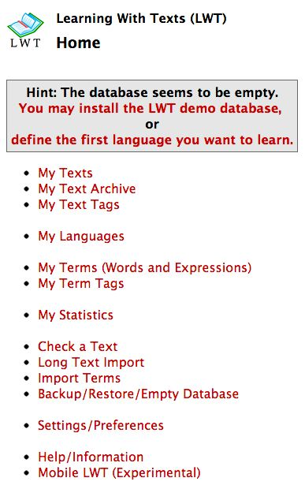  

*   **LWT home screen**  

    This is normal home screen of LWT. You may choose a language here, but you can do this also later. If you you choose a language, the language filter is pre-set to that language in some other screens. The last text you've read or tested is shown, and you may jump directly into reading, testing or printing of this last text.  

    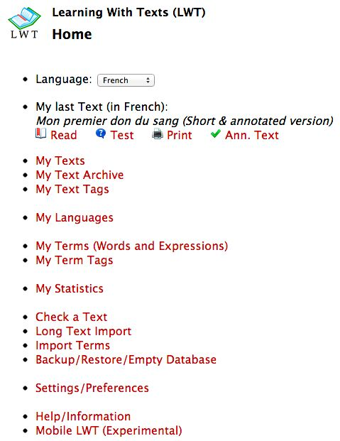  

*   **My Languages**  

    The list of languages. Here you can add a new or edit an existent language. If no texts and no saved terms in a language exist, you can delete a language. If you change a language, all texts may be be automatically reparsed to refresh (and correct) the cache of sentences and text items (depends on what language settings you have changed). You can do this also manually by clicking on the yellow flash icon. You can also test all (due) terms of a language or set a language as "current" language.  

      

*   **<a name="howtolang" id="howtolang">New/Edit Language</a>**  

    This is the place to define or edit a language you want to study.  

    **If you are new to the system, use the "Language Settings Wizard" first.** You only select your native (L1) and study (L2) languages, and let the wizard set all language settings that are marked in yellow. You can always adjust the settings afterwards.  

    **Explainations of the input fields** - please read also [this section](#langsetup):  

    *   The three Uniform Resource Identifiers ([URIs](http://en.wikipedia.org/wiki/Uniform_Resource_Identifier)) are URIs to three web dictionaries (the second and third is optional). Use ### as a placeholder for the searchword in the URIs. If ### is missing, the searchword will be appended. If the URI to query "travailler" in WordReference is "http://www.wordreference.com/fren/travailler", you enter: "http://www.wordreference.com/fren/###" or "http://www.wordreference.com/fren/". Another example: The URI to query "travailler" in sansagent is "http://dictionary.sensagent.com/travailler/fr-en/", so you enter in LWT "http://dictionary.sensagent.com/###/fr-en/".  

        As URI No. 3 ("Google Translate URI") is also used to translate whole sentences, I would recommend to enter here always the link to Google Translate, like shown in the examples. The link to Google Translate is "http://translate.google.com/?ie=UTF-8&sl=..&tl=..&text=###", where the two-character codes after "sl=" and "tl=" designate the [language codes (or "subtags")](http://www.iana.org/assignments/language-subtag-registry) for the source and the target language. But a different third web dictionary is of course possible, but sentence translations may not work.  

        If the searchword in the three URIs needs to be converted into a different encoding (standard is UTF-8), you can use ###encoding### as a placeholder. Normally you see this right away if terms show up wrongly in the web dictionary. Example: Linguee expects the searchword in ISO-8859-15, not in UTF-8, so you define it this way: "http://www.linguee.de/search?direction=auto&query=###ISO-8859-15###". A list of encodings can be found [here](http://php.net/manual/en/mbstring.supported-encodings.php).  

        **IMPORTANT:** Some dictionaries (including "Google Translate") don't allow to be opened within a frame set. Put an asterisk * in front of the URI (Examples: *http://mywebdict.com?q=### or *http://translate.google.com/?ie=UTF-8&sl=..&tl=..&text=###) to open such a dictionary not within the frame set but in a popup window (please don't forget to deactivate popup window blocking in your browser!).  

        One dictionary ([Glosbe](http://glosbe.com/)) has been closely integrated into LWT via the Glosbe API. To use this dictionary, input the "special" dictionary link "_glosbe_api.php?from=...&dest=...&phrase=###_" (NO "http://" at the beginning!!) with _from_: "L2 language code" (the language of your texts) and _dest_: "L1 language code" (e.g. mother tongue). To find the language codes, open [this page](http://glosbe.com/all-languages) to select the "from" (L2) language. On the next page, select the "L2 - L1" language pair. The URL of the next page shows the two language codes, here as an example "French - English": http://glosbe.com/**fr**/**en**/. The "from" code is "fr", the "dest" code is "en". Using this dictionary makes the transfer of translation(s) from the Glosbe to LWT very easy: just click on the icon next to the translations to copy them into the LWT edit screen. I recommend to use the LWT-integrated Glosbe dictionary as the "Dictionary 1 URI". Note: I cannot guarantee that the Glosbe API and this special integration will work in the future! glosbe_api.php is just an example how one can integrate a dictionary into LWT.  

        You don't know how and where to find a good web dictionary? Try these dictionary directories:
        *   [http://www.alphadictionary.com/langdir.html](http://www.alphadictionary.com/langdir.html)
        *   [http://www.lexicool.com/](http://www.lexicool.com/)If you have found a suitable web dictionary, try to translate some words and look whether the word is part of the web address (URI/URL). If yes, replace the word with ### and put this in one of the URI fields within LWT.  

    *   The entry "Text Size" defines the relative font size of the text. This is great for Chinese, etc.  

    *   "Character Substitutions" is an optional list of "from=to" items with "|" as list separator. The "from" character is replaced by the "to" character ("to" may be also empty). So different kinds of apostrophes can unified or deleted.  

    *   "RegExp Split Sentences" is a list of characters that signify a sentence ending (ALWAYS together with a following space or newline!). The space can be omitted (and it is normally), if you set "Make each character a word" to Yes (see below). Whether you include here ":" and ";" - that's your decision. See also [this table](#langsetup). Characters can be also defined in [Unicode](http://en.wikipedia.org/wiki/Unicode) form: "\x{....}"; the Chinese/Japanese full stop "。" is then "\x{3002}" (always without "). Please inform yourself about Unicode [here (general information)](http://en.wikipedia.org/wiki/Unicode) and [here (Table of Unicode characters)](http://unicode.coeurlumiere.com/).  

    *   "Exceptions Split Sentences" are a list of exceptions that are NOT to be treated as sentence endings with "|" as list separator. [A-Z] is a character range. If you don't want to split sentences after Mr. / Dr. / A. to Z. / Vd. / Vds. / U.S.A., then you should specify these here: "Mr.|Dr.|[A-Z].|Vd.|Vds.|U.S.A." (without ").  

    *   "RegExp Word Characters" is a list of characters OR character ranges "x-y" that defines all characters in a word, e.g. English: "a-zA-Z", German: "a-zA-ZaöüÄÖÜß", Chinese: 一-龥. See also [this table](#langsetup). Characters can be also defined in [Unicode](http://en.wikipedia.org/wiki/Unicode) form: "\x{....}"; the Chinese/Japanese character "one" "一" is then "\x{4E00}" (always without "). So the above specification for the range of characters in Chinese "一-龥" can also be specified: "\x{4E00}-\x{9FA5}".  

    *   "Make each character a word" is a special option for Chinese, etc. This makes EVERY character a single word (normally words are split by any non-word character or a space). See also [this table](#langsetup).  

    *   "Remove spaces" is another option for Chinese, etc. It removes all spaces from the text (and the example sentences). See also [this table](#langsetup).  

    *   "Right-To-Left Script" must be set to "Yes" if the language/script is written from right to left, like Arabic, Hebrew, Farsi, Urdu, etc.  

    *   "Export Template". The export template controls "Flexible" Term Exports for the terms of that language. It consists of a string of characters. Some parts of this string are placeholders that are replaced by the actual term data, [see this table](info_export_template.htm). For each term (word or expression), that has been selected for export, the placeholders of the export template will be replaced by the term data and the string will be written to the export file. If the export template is empty, nothing will be exported.  
    To understand all these options, please study also [this](#langsetup), look at the examples and play around with different settings and different texts.  

    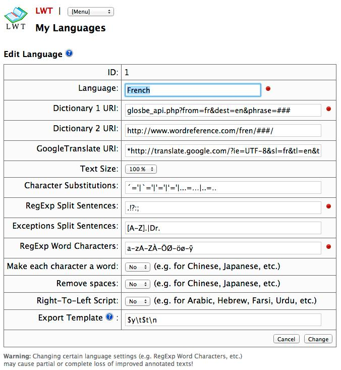  

*   **My Texts**  

    The list of texts. You can filter this list according to language, title (wildcard = *) or text tag(s) (see also below). The most important links for each text are "Read" and "Test" - that's the place to read, to listen, to save terms and to review and test your terms in sentence context. To see all terms of a text that you have saved, click on the numbers in column "Saved Wo+Ex". To print, archive, edit (and reparse), or to delete a text, click on the icons in column "Actions". There are more actions available, see "Multi Actions".  

      

    **Multi Actions for marked texts**  

    You can test the terms of the marked texts, delete or archive the marked texts. "Reparse Texts" rebuilds the sentence and the text item cache for all marked texts. "Set Term Sentences" sets a valid sentence (with the term in {..}) for all those saved or imported terms that occur in the text and that do not have a sentence at all or none with {term}. This makes it easy to "create" sentence examples for imported terms.  

    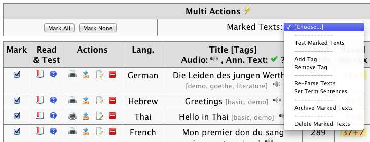  

*   **My Text Tags**  

    The list of your text tags. You can manage your text tags here. With text tags, it will be easier to categorize and organize your texts. The tags are case sensitive, have 1 to 20 characters, and must not contain any spaces or commas.  

    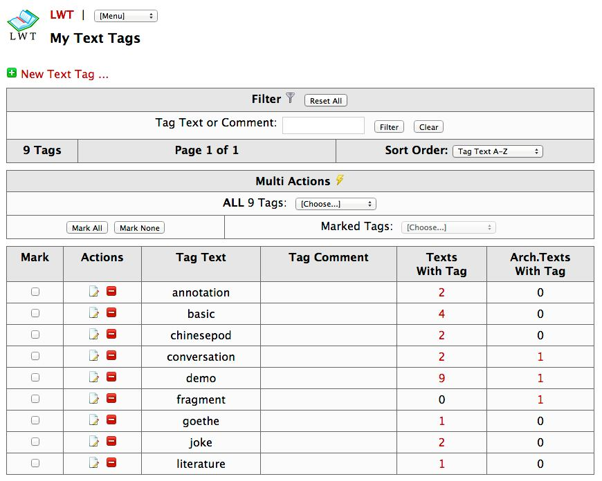  

*   **<a name="howtotext" id="howtotext">New/Edit Text (with Check)</a>**  

    This is the screen to input, check or edit a single text. Try to store not too long texts (the maximum length is 65,000 Bytes). If texts are very long (> 1000 words), certain operations (e.g. loading a text for reading, calculation of known/unknown words) may be quite slow. An audio URI and a link to the text source can also be defined. The best place to store your audios is the "media" subdirectory below the installation directory "lwt" (you have to create it yourself, and you have to copy the audio files into this directory; click Refresh if you don't see just copied media). But a cloud webspace service like DropBox is also possible. In the moment there is no possibility to import/upload an audio file within the LWT application. By the way, you can use MP3, WAV, or OGG media files, but be aware that not all browsers and/or operating systems support all media types! If you click "Check", the text will be parsed and split into sentences and words according to your language settings. Nothing will be stored if you check a text. You can see whether your text needs some editing, or whether your language settings (especially the ones that influence parsing/splitting) need an adjustment. Words (not expressions) that are already in your word list are displayed in red, and the translation is displayed. The Non-Word List shows all stuff between words. The "Check a Text" function can also be started directly from the main menu. If you click on "Change" or "Save", the text will be only saved. If you click on "Change and Open" or "Save and Open", the text will be saved and opened right away.  

      

    You can also import a longer text into LWT with the possibility to split it up into several smaller texts. Click on "Long Text Import". You must specify the maximum number of sentences per text, and the handling of newlines for paragraph detection. It is not possible to specify audio files or URIs.  

    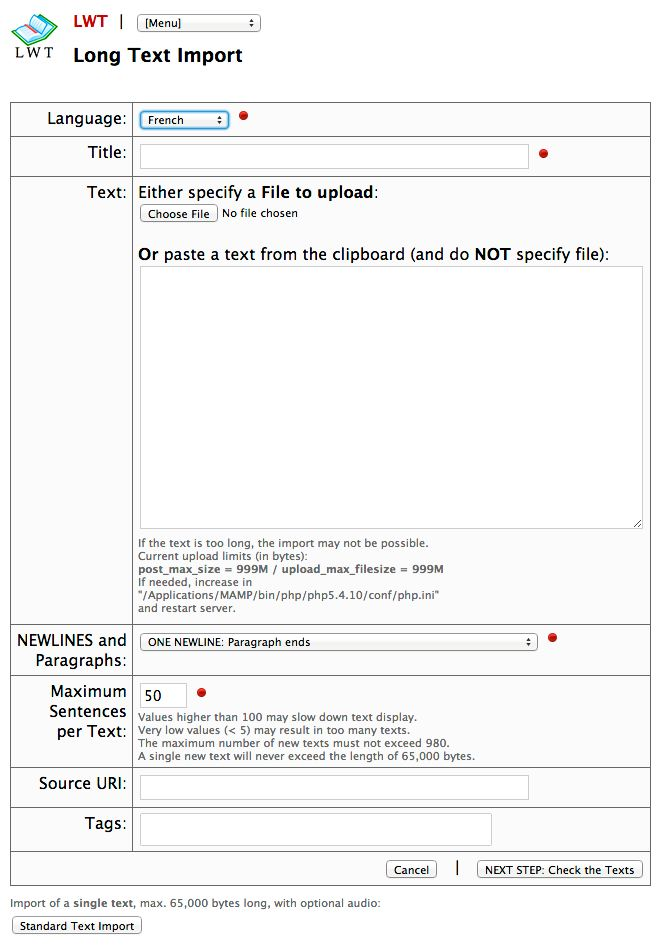  

*   **Read a Text**  

    This is your "working area": Reading (and listening to) a text, saving/editing words and expressions, looking up words, expressions, sentences in external dictionaries or Google Translate. To create an expression, click on the first word. You see "Exp: 2..xx 3..yy 4..zz ...". Just click on the number of words (2..9) of the desired expression you want to save. The dictionary links for multi word expressions are always in the edit frame! You can also use the Keyboard in the text frame, see [Key Bindings](#keybind). Double clicking on a word sets the audio position approximately to the text position, if an audio was defined. The other audio controls are self-explanatory: automatic repeat, rewind and move forward n seconds, etc.).  

    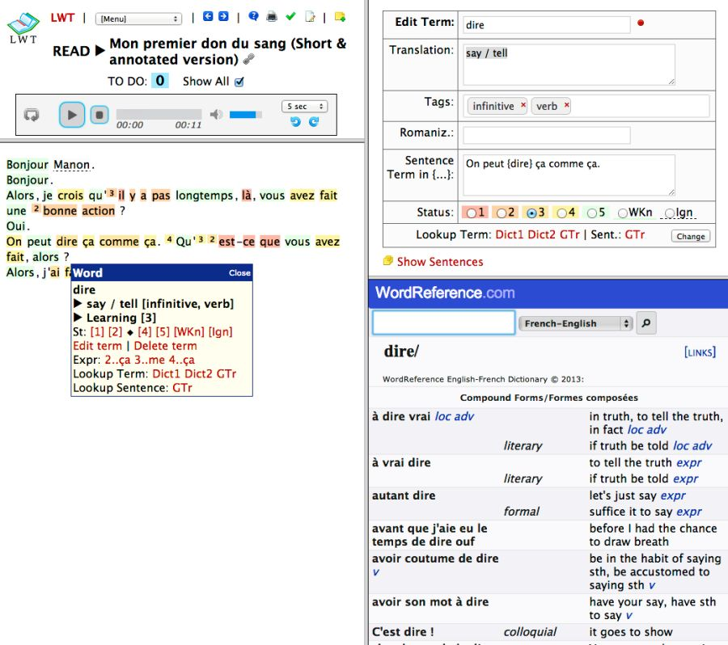  

    Reading a Right-To-Left Script (Hebrew):  

      

    With the checkbox [Show All] you can switch the display of text:  

    [Show All] = ON (see below): All terms are shown, and all multi-word terms are shown as superscripts before the first word. The superscript indicates the number of words in the multi-word term.  

    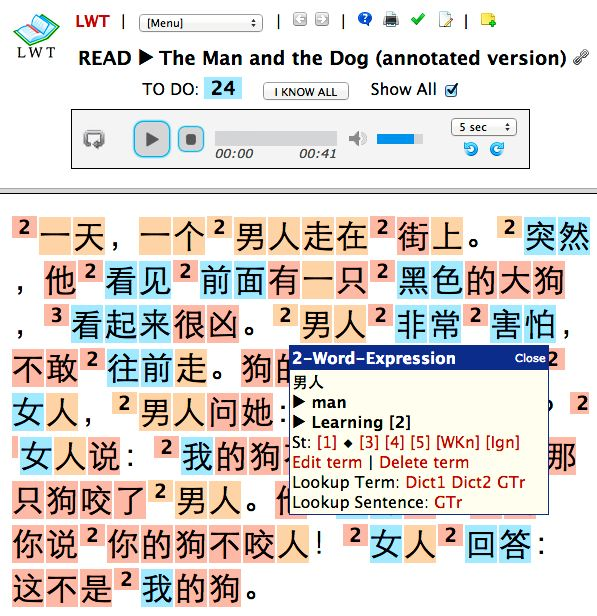  

    [Show All] = OFF (see below): Multi-word terms now hide single words and shorter or overlapping multi-word terms. This makes it easier to concentrate on multi-word terms while displaying them without superscripts, but creation and deletion of multi-word terms can be a bit slow in long texts.  

      

*   **Test terms**  

    Tests are only possible if a term has a translation. Terms with status "Ignored" and "Well Known" are never tested, and terms with a positive or zero score are not tested today. In summary, the term score must fall below zero to trigger the test. See also [Term scores](#termscores). Terms that are due today are marked with a red bullet in the term table. Terms that are due tomorrow are marked with a yellow bullet in the term table.  

    During a test, a status display (at the bottom of the test frame) shows you the elapsed time "mm:ss", a small bar graph, and the total, not yet tested, wrong and correct terms in this test.  

    In the following, L1 denotes you mother tongue (= translations), and L2 the language you want to learn (= the terms (words and expressions).  

*   **Test terms in a text (L2 -> L1)**  

    This is Test #1 or #4: L2 -> L1 (recognition) - to train your ability to recognize a L2 term. You may test within sentence context (Button "..[L2].."), or just the term (Button "[L2]"). You can also use the Keyboard in the test frame, see [Key Bindings](#keybind).  

      

*   **Test terms in a text (L1 -> L2)**  

    This is Test #2 or #5: L1 -> L2 (recall) - to train your ability to produce a term from L1\. You may test within sentence context (Button "..[L1].."), or just the term (Button "[L1]"). You can also use the Keyboard in the test frame, see [Key Bindings](#keybind).  

    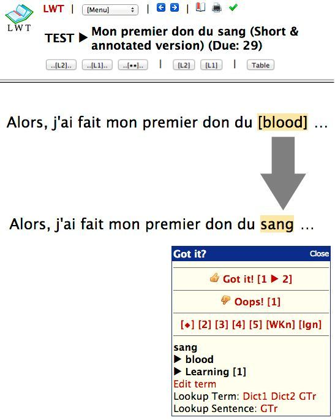  

*   **Test terms in a text (••• -> L2)**  

    This is test #3: ••• -> L2 (recall) - to train your ability to produce a term only from the sentence context (Button "..[••].."). If you hover over "[•••]", a tooltip displays the translation of the term. You can also use the Keyboard in the test frame, see [Key Bindings](#keybind).  

      

*   **Test yourself in a table / word list format (Button "Table")**  

    This is test #6: The selected terms and expressions are presented as a table. You can make invisible either the columns "Term" or "Translation", and you can hide or show the columns "Sentence", "Romanization", "Status" and "Ed" (Edit). To reveal the invisible solution ("Term" or "Translation"), you just click into the empty table cell. You can review or test yourself with or without changing the status by clicking "+" or "-" in the "Status" column. A status in red signifies that the term is due for testing. You can also edit the term by clicking the yellow "Edit" icon. Columns 2 to 6 may also my sorted by clicking on the header row. The initial sort order is according to term score.  

      

*   **Print a text**  

    Here you print a text. Optional: an inline annotation (translation and/or romanization) of terms that are of specified status(es). This screen is also great to just read or study a text.  

    Chinese Text with annotation (Romanization/Pinyin and translation):  

      

    Chinese Text with annotation (only Romanization/Pinyin):  

      

    **How to create, edit, and use an _Improved Annotated Text_:**  

    **Motivation:** Annotated texts (as [interlinear text](http://en.wikipedia.org/wiki/Interlinear_gloss)) have been used for language learning for a long time. One example are the word-by-word translations in [Assimil](http://en.assimil.com/) courses. The German [V. F. Birkenbihl](http://web.archive.org/web/20070223080453/http://195.149.74.241/BIRKENBIHL/PDF/MethodEnglish.pdf) proposes the creation of interlinear word-by-word or [hyperliteral](http://learnanylanguage.wikia.com/wiki/Hyperliteral_translations) translations (calling this creation "decoding") in foreign language learning. Learning Latin or Ancient Greek via interlinear texts is quite old as you can see in [this YouTube video](http://www.youtube.com/watch?v=XnEKnezLXJg).  

    LWT's old "Print Screen" offers annotations, but it displays ALL translations of a term. The _Improved Annotated Text_ feature enables you to select the best translation for every word in the text. As a result, you create an L1 word-by-word translation that is displayed above the L2 text. This interlinear text is better suited for language study, especially for beginners.  

    **Method:** While listening to the audio, first follow the blue annotations in your native language while listening and understanding. Later, after understanding the text fully, you read the foreign language text alone. Repeat this often. After these steps, you listen to the text passively or do shadowing.  

    On the Print Screen, click on "Create" an Improved Annotated Text. The system creates a default annotated text.  

    **Edit Mode:**  

    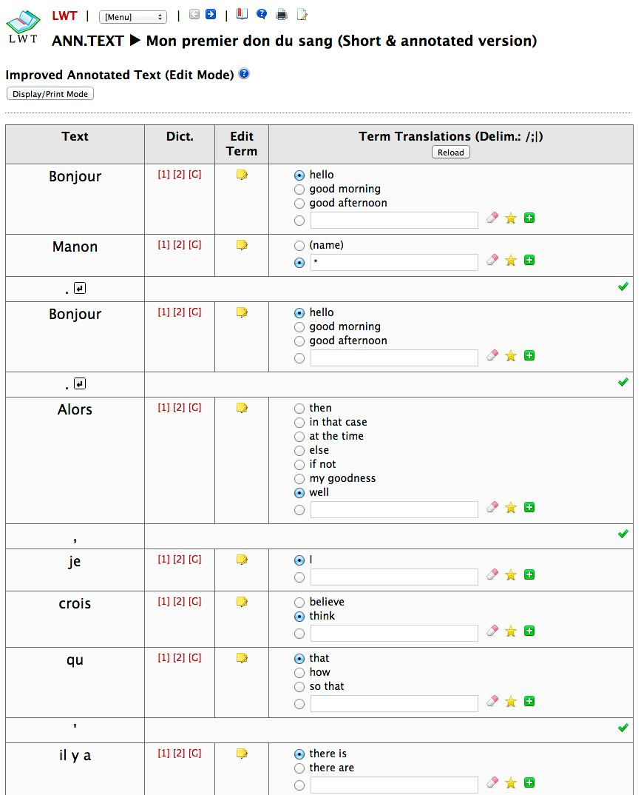  

    Within the "Improved Annotated Text - Edit Mode", you can select the best term translation by clicking on one of the radio buttons. To be able to do this, multiple translations must be delimited by one of the delimiters specified in the LWT Settings (currently: /;|). You can also type in a new translation into the text box at the end (this does not change your saved term translation), or you may change your term by clicking on the yellow icon or add a translation by clicking on the green "+" icon (this does change your saved term translation), and select it afterwards. The "Star" icon indicated that you want the term itself as annotation. **Important:** It's not possible to create new terms here - please do this in the "Read text" screen. Changing the language settings (e.g. the word characters) may have the effect that you have to start from scratch. The best time for the creation of an improved annotated text is after you have read the text completely and created all terms and expressions in the "Read text" screen.  

    **Warning:** If you change the text, you will lose the saved improved annotated text!  
    All changes in the Edit screen are saved automatically in the background!  

    To leave the Edit mode, click on "Display/Print Mode". You may then print or display (with audio) the text, and work with the text online or offline.  

    **Print Mode:**  

    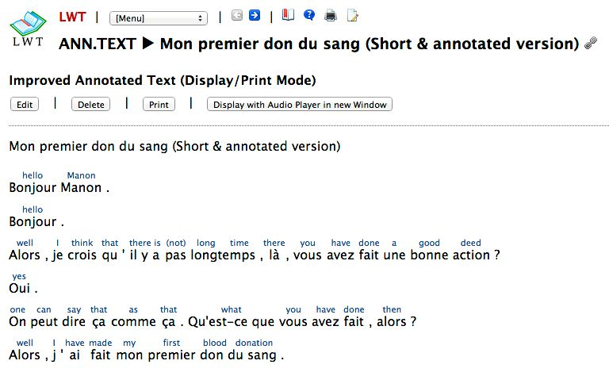  

    **Display Mode** (with audio player) in a separate window. Clicking the "T" or "A" lightbulb icons hides/shows the text or the blue annotations. You may also click on a single term or a single annotation to show or to hide it. This enables you to test yourself or to concentrate on one text only. Romanizations, if available, appear while hovering over a term.  

    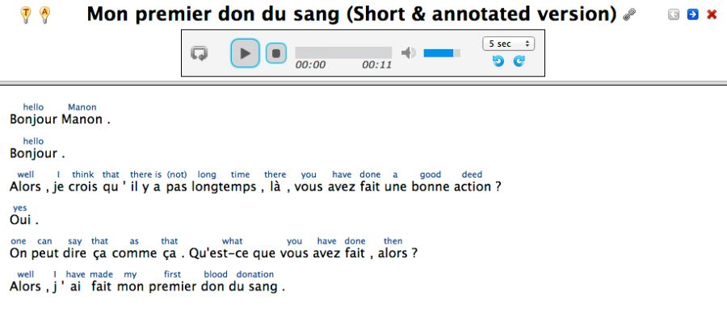  

*   **My Terms**  

    The list of your saved words or expressions (= terms). You may filter the list of terms by language, text, status, term/romanization/translation (wildcard * possible) or term tag(s). Different sort orders are possible. You can do "multi actions" only on the marked or on all terms (on all pages!). "Se?" displays a green dot if a valid sentences with {term} exists. "Stat/Days" displays the status and the number of days since the last status change. The score of a term is a rough measure (in percent) how well you know a term. Read more about term scores [here](#termscores). Terms with zero score are displayed red and should be tested today.  

      

    **Multi Actions for marked terms**  

    Most actions are self-explanatory. "Test Marked Terms" starts a test with all marked terms. You may delete marked terms and change the status of marked terms. "Set Status Date to Today" is some kind of "trick" for vacations, illnesses, etc.  

    "Export Marked Texts (Anki)" exports all terms that have been marked AND have a valid sentence with {term} for Anki. Terms that do not have a sentence with {term} will NOT be exported. Cloze testing of terms within sentence context can so be easily done in Anki. The export is tab-delimited: (1) term, (2) translation, (3) romanization, (4) Sentence without term (question of cloze test), (5) Sentence with term (answer of cloze test), (6) Language, (7) ID Number, (8) Tag list. Anki template decks (for Anki Version 1 and 2) are provided: "LWT.anki" and "LWT.apkg" in directory "anki".  

    "Export Marked Texts (TSV)" exports all terms that have been marked. The export is tab-delimited: (1) term, (2) translation, (3) sentence, (4) romanization, (5) status, (6) language, (7) ID Number, (8) tag list.  

      

    **Multi Actions for all terms on all pages of the current query**  

    Explanations see above.  

    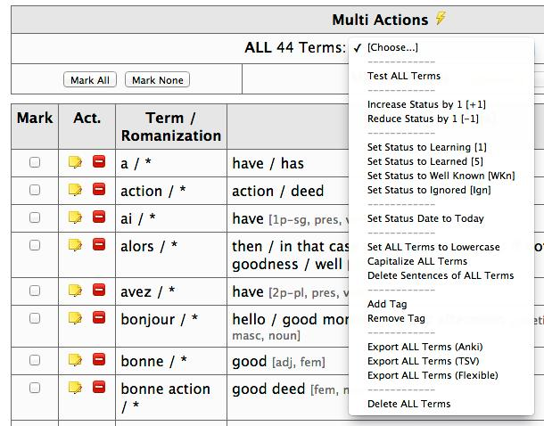  

*   **My Term Tags**  

    The list of your term tags. You can manage your term tags here. With term tags, it will be easier to categorize and organize your terms. The tags are case sensitive, have 1 to 20 characters, and must not contain any spaces or commas.  

    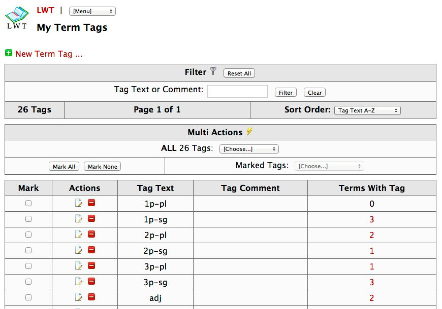  

*   **My Text Archive**  

    The list of archived texts. To unarchive, to edit or to delete a text, click on the icon under "Actions". There are also "Multi Actions" available.  

    What is the difference between (active) texts and archived texts?  

    *   **(Active) texts**
        *   They have been parsed and tokenized according to the rules defined for the language.
        *   The result is stored in a cache of sentences and text items.
        *   They use a lot of space in the database.
        *   Reading with term creation/editing and dictionary lookup is possible.
        *   Testing of a stored term that occurs in the text, is possible. A terms will be tested within the context of any sentence(s) in all active texts (the number of sentences may be set (1, 2, or 3) as a preference).  

    *   **Archived texts**
        *   They are not parsed and tokenized, only the text is stored.
        *   Compared with active texts, they don't use much space in the database, because no sentences and no text items are stored.
        *   Reading with term creation/editing and dictionary lookup is not possible.
        *   Testing of a stored term, that occurs in the text, is possible, but a term will be tested ONLY within the context of the sentence(s) that has/have been stored with the term in the sentence field, if the term does not occur in any active text.  

    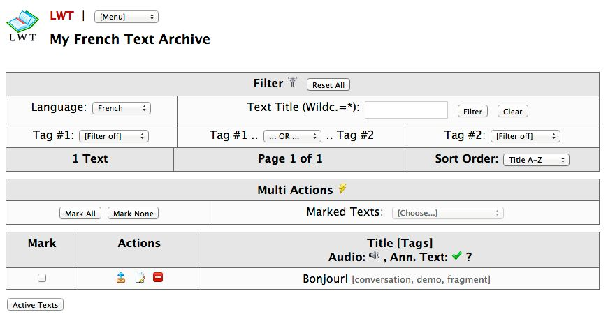  

    **Multi Actions for marked archived texts**  

      

*   **My Statistics**  

    It's self-explanatory and shows your performance. The numbers in the first table are links, by clicking on them you jump to the table of all terms in that status and language.  

    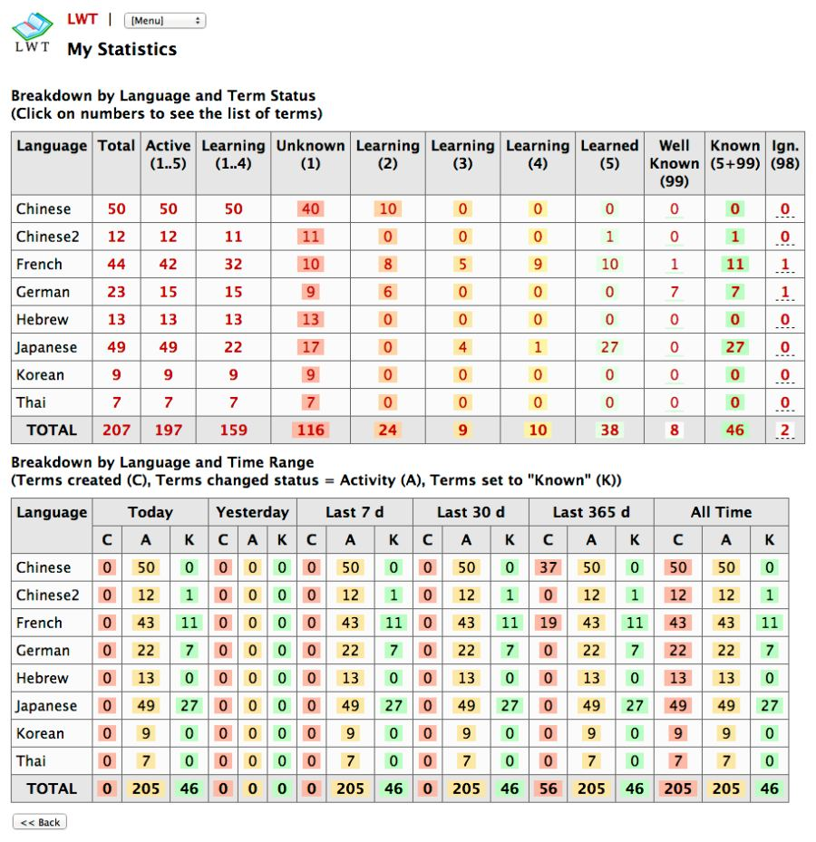  

*   **Import Terms**  

    Import a list of terms for a language, and set the status for all to a specified value. You can specify a file to upload or type/paste the data directly into the textbox. Format: one term per line, fields (columns) are separated either by comma ("CSV" file, e.g. used in LingQ as export format), TAB ("TSV" file, e.g. copy and paste from a spreadsheet program, not possible if you type in data manually) or # (if you type in data manually). The field/column assignment must be specified on the left. Important: You must import a term. The translation can be omitted if the status should be set to 98 or 99 (ignore/well known). Translation, romanization and sentence are all optional, but please understand that tests are only possible if terms have a translation. If a term already exists in the database (comparison is NOT case sensitive), it will not be overwritten; the line will be ignored. You can change this by setting "Overwrite existent terms" to "Yes". Be careful using this screen, a database backup before the import and double-checking everything is always advisable!  

    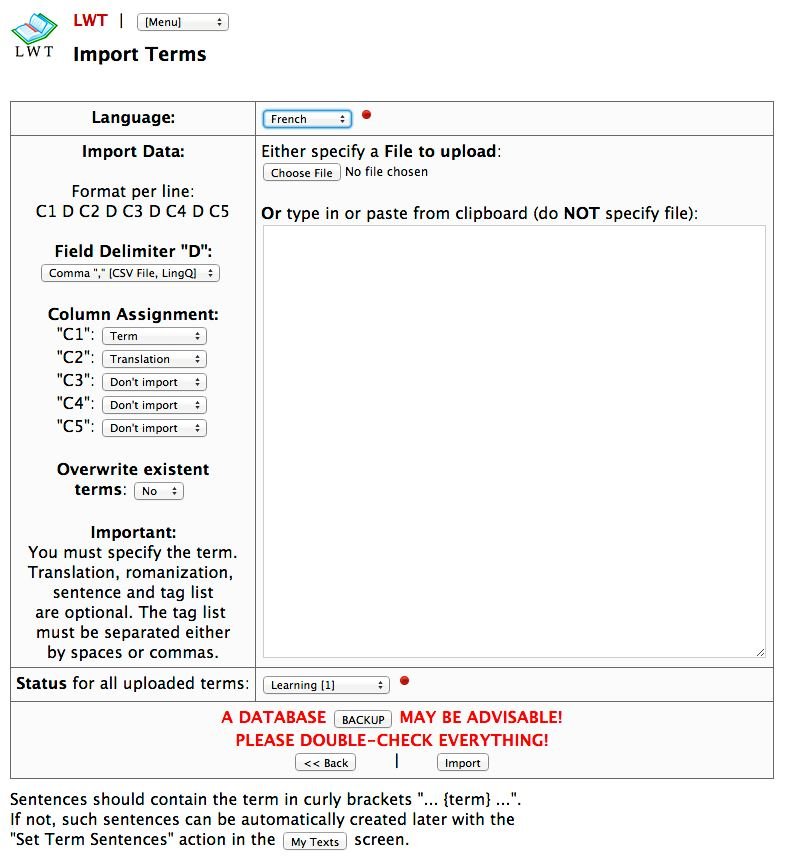  

*   **Backup/Restore/Empty Database**  

    This screen offers a possibility to save, restore or empty the LWT database (ONLY the current table set!). This makes it easy to try out new things or just to make regular backups. "Restore" only accepts files that have been created with the "Backup" function above. "Empty Database" deletes the data of all tables (except the settings) of the current table set, and you can start from scratch afterwards. Be careful: you may lose valuable data!  

    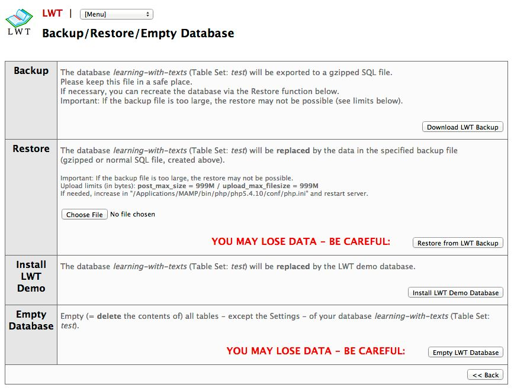  

*   **Settings/Preferences**  

    In this screen you can adjust the program according to your needs. The geometric properties of the _Read Text_ and _Test_ screens can be changed. This is important because different browsers and font sizes may result in an unpleasant viewing experience. The waiting time to display the next test and to hide the old message after a test assessment can also be changed. The number of sentences displayed during testing and generated during term creation can be set to 1 (default), 2 or 3; if set to 2 or 3 you are able to do "MCD" (Massive-Context Cloze Deletion) testing, proposed by Khatzumoto @ AJATT. The number of items per page on different screens can be set, and you can decide whether you want to see the word counts on the textpage immediately (page may load slow) or later (faster initial loading).  

    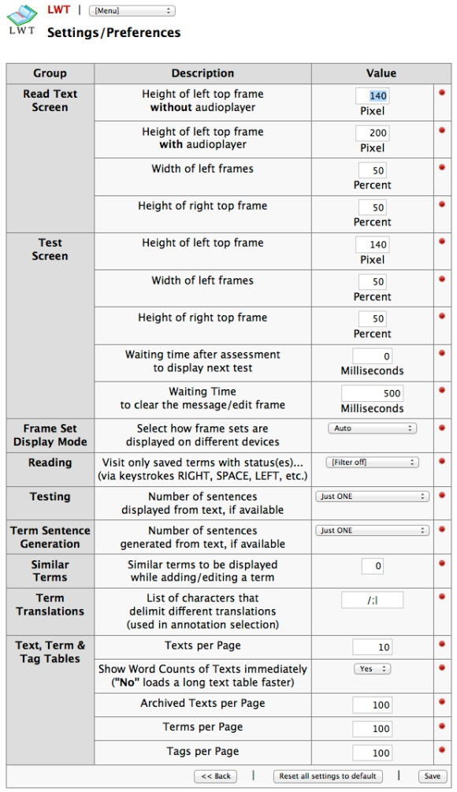  

*   **Multiple LWT table sets**  

    **WARNING:** The use of the "Multiple LWT table sets" feature on an external web server may cause a **monstrous database size** if some users import many or large texts. Without further improvements (e. g. user quotas, etc.), LWT with activated "Multiple LWT table sets" is in its current version **not suitable** to be run in a public environment on an external web server!  

    When you start using LWT, you store all your data in the "Default Table Set" within the database you have defined in the file "connect.inc.php" during the LWT installation.  

    Beginning with LWT Version 1.5.3, you are able to create and to use unlimited LWT table sets within one database (as space and MySQL limitations permit). This feature is especially useful for users who want to set up a multi user environment with a set of tables for each user. You can also create one table set for every language you study - this allows you to create different term/text tags for each language. If you don't need this feature, you just use LWT like in earlier versions with the "default table set". Please observe that the "Backup/Restore/Empty Database" function only works for the CURRENT table set, NOT for ALL table sets you have created!  

    Just click on the link at the bottom of the LWT home screen where the current table set name (or "Default") is displayed. In a new screen "Select, Create or Delete a Table Set" you may switch and manage table sets. A table set name is max. 20 characters long. Allowed characters are only: a-z, A-Z, 0-9, and the underscore "_".  

    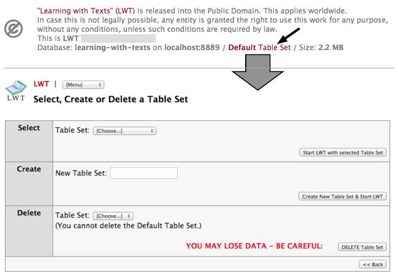  

    If you want "switch off" this feature, and use just one table set, you may define the name in the file "connect.inc.php":  

    **$tbpref = "";**       // only the default table set  

    **$tbpref = "setname";**       // only the table set "setname"  

    After adding such a line in the file "connect.inc.php", you are not able to select, create or delete table sets anymore. Only the one you have defined in "connect.inc.php" will be used. Please observe the rules for table set names (see above)!!  

    If more than one table set exists, and $tbpref was NOT set to a fixed value in "connect.inc.php", you can select the desired table set via "start.php" (use this as start page if several people use their own table set), or by clicking on the LWT icon or title in the LWT menu screen "index.php".  

    By hovering over the LWT icon in the top left corner of every screen, you can display the current table set in a yellow tooltip.  

</dd>

<dt>▶ **<a name="faq" id="faq">Questions and Answers</a>**</dt>

<dd>

*   I want to use LWT, and I see something like this:  

      

    Answer: Your local webserver (Apache) is not running. Please start it via EasyPHP or MAMP control program/panel.  

*   I want to use LWT, and I see something like this:  

      

    Answer: The server is running, but the application is not found. Maybe the Uniform Resource Identifier (URI) is wrong or misspelled. Please check/correct it. Or the URI is correct, and the application is installed, but not in the correct directory _lwt_ below _htdocs_. Please install/copy/move it into the correct directory.  

*   I want to use LWT, and I see this:  

      

    Answer: Either the database (MySQL) is not running, or the database connection parameters in _../htdocs/lwt/connect.inc.php_ are wrong. Please check/correct the database connection parameters and/or start MySQL via the MAMP or EasyPHP control program/panel.  

*   I want to use LWT, and I see this:  

      

    Answer: The Webserver and the database is running, but the database connection parameter file _../htdocs/lwt/connect.inc.php_ is not found. Please rename one of the connection files (according to your server) to _../htdocs/lwt/connect.inc.php_.  

*   I have installed or updated LWT on Linux, but the application does not run as expected:  

    Answer 1: The Webserver does not have full access to all LWT files (insufficient rights). Open a terminal window, go to the directory where the directory "lwt" has been created with all LWT files, e. g.  
    **cd /var/www/html**  
    Now execute:  
    **sudo chmod -R 755 lwt**.  

    Answer 2: The PHP "mbstring" extension is not installed. Please install it; [see this article](https://askubuntu.com/questions/491629/how-to-install-php-mbstring-extension-in-ubuntu).  

</dd>

<dt>▶ **<a name="ipad" id="ipad">Setup for Tablets</a>**</dt>

<dd>

*   If you want to use LWT on a tablet: that's possible (even the audio player works!).
*   In "Settings/Preferences", set the "Frame Set Display Mode" to "Auto" or "Force Mobile". On other mobile devices, you may also try "Force Non-Mobile" if you are unhappy with the results.
*   Try to reduce the length of your texts to reduce scrolling.
*   It's also a good idea to install and run LWT at a web hoster. So you can access LWT easily if you are often on the go.
*   I hope you will enjoy using LWT on a tablet although creating new terms and copy & paste can be a bit tedious.  

</dd>

<dt>▶ **<a name="langsetup" id="langsetup">Language Setup</a>**</dt>

<dd>

*   This section shows some language setups ("RegExp Split Sentences", "RegExp Word Characters", "Make each character a word", "Remove spaces") for different languages. They are only recommendations, and you may change them according to your needs (and texts). See also [here](#go1).  

*   If you are unsure, try the "Language Settings Wizard" first. Later you can adjust the settings.  

*   Please inform yourself about Unicode [here (general information)](http://en.wikipedia.org/wiki/Unicode) and [here (Table of Unicode characters)](http://unicode.coeurlumiere.com/) and about the characters that occur in the language you learn!  

    <table class="tab3" cellspacing="0" cellpadding="5">

    <tbody>

    <tr class="tr1">

    <th class="th1">Language</th>

    <th class="th1">RegExp  
    Split  
    Sentences</th>

    <th class="th1">RegExp  
    Word  
    Characters</th>

    <th class="th1">Make each  
    character  
    a word</th>

    <th class="th1">Remove  
    spaces</th>

    </tr>

    <tr class="tr1">

    <td class="td1">Latin and all languages  
    with a Latin derived alphabet  
    (English, French, German, etc.)</td>

    <td class="td1">.!?:;</td>

    <td class="td1">a-zA-ZÀ-ÖØ-öø-ȳ</td>

    <td class="td1">No</td>

    <td class="td1">No</td>

    </tr>

    <tr class="tr1">

    <td class="td1">Languages with a  
    Cyrillic-derived alphabet  
    (Russian, Bulgarian, Ukrainian, etc.)</td>

    <td class="td1">.!?:;</td>

    <td class="td1">a-zA-ZÀ-ÖØ-öø-ȳЀ-ӹ</td>

    <td class="td1">No</td>

    <td class="td1">No</td>

    </tr>

    <tr class="tr1">

    <td class="td1">Greek</td>

    <td class="td1">.!?:;</td>

    <td class="td1">\x{0370}-\x{03FF}\x{1F00}-\x{1FFF}</td>

    <td class="td1">No</td>

    <td class="td1">No</td>

    </tr>

    <tr class="tr1">

    <td class="td1">Hebrew (Right-To-Left = Yes)</td>

    <td class="td1">.!?:;</td>

    <td class="td1">\x{0590}-\x{05FF}</td>

    <td class="td1">No</td>

    <td class="td1">No</td>

    </tr>

    <tr class="tr1">

    <td class="td1">Thai</td>

    <td class="td1">.!?:;</td>

    <td class="td1">ก-๛</td>

    <td class="td1">No</td>

    <td class="td1">Yes</td>

    </tr>

    <tr class="tr1">

    <td class="td1">Chinese</td>

    <td class="td1">.!?:;。！？：；</td>

    <td class="td1">一-龥</td>

    <td class="td1">Yes or No</td>

    <td class="td1">Yes</td>

    </tr>

    <tr class="tr1">

    <td class="td1">Japanese</td>

    <td class="td1">.!?:;。！？：；</td>

    <td class="td1">一-龥ぁ-ヾ</td>

    <td class="td1">Yes or No</td>

    <td class="td1">Yes</td>

    </tr>

    <tr class="tr1">

    <td class="td1">Korean</td>

    <td class="td1">.!?:;。！？：；</td>

    <td class="td1">가-힣ᄀ-ᇂ</td>

    <td class="td1">No</td>

    <td class="td1">No or Yes</td>

    </tr>

    </tbody>

    </table>

*   "\'" = Apostrophe, and/or "\-" = Dash, may be added to "RegExp Word Characters", then words like "aujourd'hui" or "non-government-owned" are one word, instead of two or more single words. If you omit "\'" and/or "\-" here, you can still create a multi-word expression "aujourd'hui", etc., later.  

*   ":" and ";" may be omitted in "RegExp Split Sentences", but longer example sentences may result from this.  

*   "Make each character a word" = "Yes" should only be set in Chinese, Japanese, and similar languages. Normally words are split by any non-word character or whitespace. If you choose "Yes", then you do not need to insert spaces to specify word endings. If you choose "No", then you must prepare texts without whitespace by inserting whitespace to specify words. If you are a beginner, "Yes" may be better for you. If you are an advanced learner, and you have a possibility to prepare a text in the above described way, then "No" may be better for you.  

*   "Remove spaces" = "Yes" should only be set in Chinese, Japanese, and similar languages to remove whitespace that has been automatically or manually inserted to specify words.

</dd>

<dt>▶ **<a name="termscores" id="termscores">Term Scores</a>**</dt>

<dd>

*   The score of a term is a rough measure (in percent) how well you know a term. It is displayed in "My Terms", and it is used in tests to decide which terms are tested next.  

*   The score is calculated as follows:  

    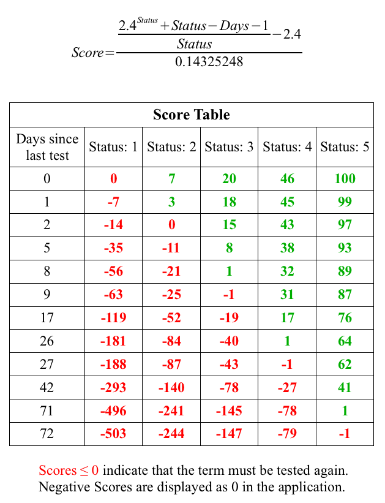  

    Terms with status 1 are tested either today (if not created today) or tomorrow (if created today, or a test failed today). Terms set to status 2 should be retested after 2 days. Terms set to status 3 should be retested after 9 days. Terms set to status 4 should be retested after 27 days. Terms set to status 5 should be retested after 72 days.  

*   Example 1: Five terms were tested today; they are now in status 1, 2, 3, 4, and 5\. The term with status 1 is still unknown (failed the test, so the score is still 0 %). The term with status 5 is well known (score: 100 %).  

      

*   Example 2: Five terms were not tested for some time; they are in status 1, 2, 3, 4, and 5\. All of them have a score of 0, because the number of days indicate that you may have forgotten them. Therefore all should be retested today.  

    

</dd>

<dt>▶ **<a name="keybind" id="keybind">Key Bindings</a>**</dt>

<dd>

*   Important: Before using the keyboard you must set the focus within the frame by clicking once on the frame!  

*   Key Bindings in the TEXT Frame  

    <table class="tab3" cellspacing="0" cellpadding="5">

    <tbody>

    <tr class="tr1">

    <th class="th1">Key(s)</th>

    <th class="th1">Action(s)</th>

    </tr>

    <tr class="tr1">

    <td class="td1">RETURN</td>

    <td class="td1">The next UNKNOWN (blue) word in the text will be shown for creation</td>

    </tr>

    <tr class="tr1">

    <td class="td1">RIGHT or SPACE</td>

    <td class="td1">Mark next SAVED (non-blue) term (*)</td>

    </tr>

    <tr class="tr1">

    <td class="td1">LEFT</td>

    <td class="td1">Mark previous SAVED (non-blue) term (*)</td>

    </tr>

    <tr class="tr1">

    <td class="td1">HOME</td>

    <td class="td1">Mark first SAVED (non-blue) term (*)</td>

    </tr>

    <tr class="tr1">

    <td class="td1">END</td>

    <td class="td1">Mark last SAVED (non-blue) term (*)</td>

    </tr>

    <tr class="tr1">

    <td class="td1">1, 2, 3, 4, 5</td>

    <td class="td1">Set status of marked term to 1, 2, 3, 4, or 5</td>

    </tr>

    <tr class="tr1">

    <td class="td1">I</td>

    <td class="td1">Set status of marked term to "Ignored"</td>

    </tr>

    <tr class="tr1">

    <td class="td1">W</td>

    <td class="td1">Set status of marked term to "Well Known"</td>

    </tr>

    <tr class="tr1">

    <td class="td1">E</td>

    <td class="td1">Edit marked term</td>

    </tr>

    <tr class="tr1">

    <td class="td1">A</td>

    <td class="td1">Set audio position according to position of marked term.</td>

    </tr>

    <tr class="tr1">

    <td class="td1">ESC</td>

    <td class="td1">Reset marked term(s)</td>

    </tr>

    </tbody>

    </table>

    (*) Only saved terms with the status(es) defined/filtered in the settings are visited and marked!  

*   Key Bindings in the TEST Frame  

    <table class="tab3" cellspacing="0" cellpadding="5">

    <tbody>

    <tr class="tr1">

    <th class="th1">Key(s)</th>

    <th class="th1">Action(s)</th>

    </tr>

    <tr class="tr1">

    <td class="td1">SPACE</td>

    <td class="td1">Show solution</td>

    </tr>

    <tr class="tr1">

    <td class="td1">UP</td>

    <td class="td1">Set status of tested term to (old status plus 1)</td>

    </tr>

    <tr class="tr1">

    <td class="td1">DOWN</td>

    <td class="td1">Set status of tested term to (old status minus 1)</td>

    </tr>

    <tr class="tr1">

    <td class="td1">ESC</td>

    <td class="td1">Do not change status of tested term</td>

    </tr>

    <tr class="tr1">

    <td class="td1">1, 2, 3, 4, 5</td>

    <td class="td1">Set status of tested term to 1, 2, 3, 4, or 5</td>

    </tr>

    <tr class="tr1">

    <td class="td1">I</td>

    <td class="td1">Set status of tested term to "Ignored"</td>

    </tr>

    <tr class="tr1">

    <td class="td1">W</td>

    <td class="td1">Set status of tested term to "Well Known"</td>

    </tr>

    <tr class="tr1">

    <td class="td1">E</td>

    <td class="td1">Edit tested term</td>

    </tr>

    </tbody>

    </table>

</dd>

<dt>▶ **<a name="history" id="history">Changelog</a>**</dt>

<dd>

*   1.6.2 (March 10 2018, this page "info.htm" last updated August 12 2019):  
    New features:  
    Audio playback speed can now be set between 0.5x and 1.5x.  
    Waiting wheel (to indicate saving data to database in the background) added in "Edit Improved Annotated Text".  
    Checking for characters in the Unicode Supplementary Multilingual Planes (> U+FFFF) like emojis or very rare characters improved/added. Such characters are currently not supported.  
    Updates/bug fixes:  
    jQuery library updated to v1.12.4.  
    "Mobile_Detect.php" updated to v2.8.30.  
    LWT demo database updated.  
    Documentation updated.  
    Some minor glitches fixed.  
    Glosbe API calls via "glosbe_api.php" in demo database and language settings wizard removed - they often did not work due to API restrictions. The file "glosbe_api.php" is still supplied as an example of a close integration of a dictionary API into LWT.  

*   1.6.1 (February 01 2016, this page "info.htm" last updated January 13 2018):  
    The jQuery and jPlayer libraries have been updated to v1.12.0 and v2.9.2, respectively. The jQuery.ScrollTo package has been updated to v2.1.2.  
    [Link](#links) to Chinese text segmentation "Jieba" added in documentation (Important Links - Additional Resources - For learners of Chinese).  

*   1.6.0 (January 28 2016):  
    As mysql_* database calls are deprecated and are no longer supported by PHP, they have been changed to the corresponding mysqli_* calls. If you run a server with PHP version 7.0.0 or higher, you MUST use LWT 1.6.0 or higher. Thanks to Laurens Vercaigne for his work!  
    Debugging updated. Status information on start page improved. Documentation updated.  
